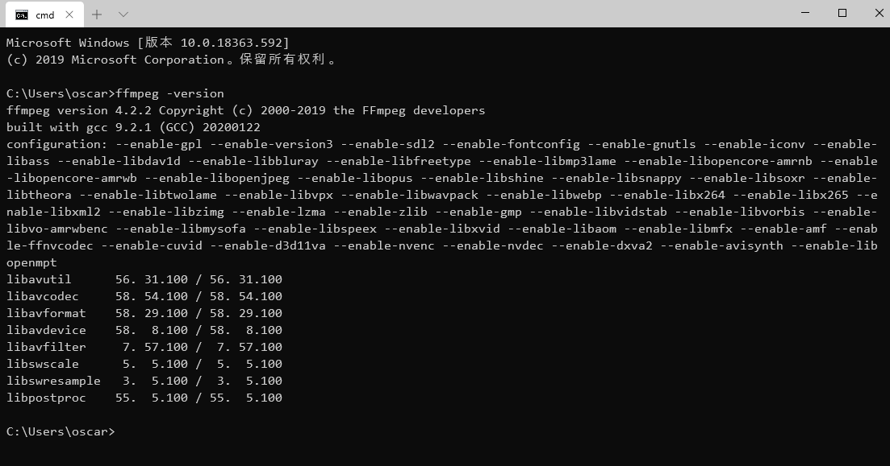

FFmpeg是领先的多媒体框架，可进行视频音频的解码，编码，转码等相关视频操作

FFMpeg PHP，一个与AVconv / ffmpeg进行通信的面向对象的库

---

## 1.安装 FFmpeg
这里以win10为例，当然也可以在Linux/macOS上进行

点击[win/macOS下载链接](https://ffmpeg.zeranoe.com/builds/)，选择合适你的版本下载安装即可

安装完成后将bin目录添加至path环境变量，命令行输入ffmpeg -version看到相关信息即为安装成功


## 2.PHP-FFMpeg
在你的项目根目录下安装

```
$ composer require php-ffmpeg/php-ffmpeg
```
## 3.使用
以下做简单介绍，详细可参考[官方文档](https://packagist.org/packages/php-ffmpeg/php-ffmpeg)

### 创建对象
```php
$ffmpeg = FFMpeg\FFMpeg::create();
$video = $ffmpeg->open('example.mp4');
```

### 视频转码
```php
$format = new FFMpeg\Format\Video\X264();
$format->on('progress', function ($video, $format, $percentage) {
    echo "$percentage % transcoded";
});

$format
    -> setKiloBitrate(1000)          // 视频码率
    -> setAudioChannels(2)        // 音频声道
    -> setAudioKiloBitrate(256); // 音频码率

$video->save($format, 'video.avi');
```

### 视频截图
```php
$frame = $video->frame(FFMpeg\Coordinate\TimeCode::fromSeconds(10));
$frame->save('image.jpg');
```
### 调整视频尺寸
```php
$video->filters()->resize($dimension, $mode, $useStandards);
```
### mp4转ts并切片输出m3u8
```php
//先将视频转换成视频ts文件
ffmpeg -y -i example.mp4 -vcodec copy -acodec copy -vbsf h264_mp4toannexb video3/output.ts
 
//将ts视频文件分割成视频流文件ts，并生成索引文件m3u8
ffmpeg -i output.ts  -c copy -map 0 -f segment -segment_list index.m3u8 -segment_time 10 video-%03d.ts
```

