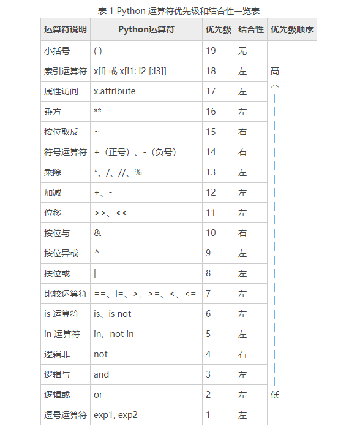

> 以Python3 版本为准
## 基本概念
- 表达式直接写对程序没影响，解释器执行会自动输出

- 语句执行对程序有影响

- 程序由语句和表达式构成

- 函数function，是一种完成特定功能的语句
    - 例如：xxx()
    - 分类：内置函数，自定义函数
    - 两要素：参数，返回值

## 基本语法
- 严格区分大小写
- 每一行就是一条语句，以换行结束
- 每一条语句不要过长，建议每行不要超过80个字符
- 一条语句可以分多行编写，语句后边以 \ 结尾
- 缩进严格
- '#' 后面写注释内容

## 字面量和变量
- 字面量就是一个个的值，比如 'hello' , 123 , 456,程序中可直接使用
- 变量可以用来保存字面量，并且变量中保存的字面量是不定的，比如 a = 10
- 一般开发时很少直接用字面量，都是通过变量引用字面量

## 变量和标识符 
- 变量不需要声明，直接赋值使用，不能使用未赋值的变量
- 可以为变量赋值任意类型，亦可以修改
- 标识符，可以自主命名的内容属于标识符，如变量名 函数名 类名
    * 标识符不能数字开头，可包含字母，数字，__
    * 要符合标准规范，不能和python关键字和保留字以及内置函数名冲突
    * 下划线命名规范：aa_bb_cc
    * 帕斯卡(大驼峰)命名规范：HelloWorld
## 数据类型
- 变量值得类型，也就是可以为哪些变量赋值
    * python数值类型分三种：整数，浮点数（小数），复数
    * 字符串
    * 布尔值和空值，布尔值属于整型
## 类型检查
    type()函数返回值可以看到输出变量类型

## 对象（object）
- Python是一门面向对象的语言
- 一切皆对象！
- 程序运行当中，所有的数据都是存储到内存当中然后再运行的！
- 对象就是内存中专门用来存储指定数据的一块区域
- 对象实际上就是一个容器，专门用来存储数据
- 像数值、字符串、布尔值、None都是对象

## 对象的结构
- 每个对象中都要保存三种数据
    - id（标识）
        * id用来标识对象的唯一性，每一个对象都有唯一的id
        * 对象的id就相当于人的身份证号一样
        * 可以通过id()函数来查看对象的id
        * id是由解析器生成的，在CPython中，id就是对象的内存地址
        * 对象一旦创建，则它的id永远不能再改变

    - type（类型）
        * 类型用来标识当前对象所属的类型
        * 比如：int str float bool 。。。
        * 类型决定了对象有哪些功能
        * 通过type()函数来查看对象的类型
        * Python是一门强类型的语言，对象一旦创建类型便不能修改

    - value（值）
        * 值就是对象中存储的具体的数据
        * 对于有些对象值是可以改变的
        * 对象分成两大类，可变对象 不可变对象
            可变对象的值可以改变
            不可变对象的值不能改变，之前学习的对象都是不可变对象 

## 变量和对象
- 对象并没有直接存储到变量中，在Python中变量更像是给对象起了一个别名
- 变量中存储的不是对象的值，而是对象的id（内存地址），
    当我们使用变量时，实际上就是在通过对象id在查找对象
- 变量中保存的对象，只有在为变量重新赋值时才会改变
- 变量和变量之间是相互独立的，修改一个变量不会影响另一个变量

## 类型转换
- 将一个类型的对象转换为其他对象
- 不是改变对象本身的类型，而是根据当前对象的值创建一个新的对象

## 运算符
- 运算符可以对一个值或多个值进行运算或各种操作
    - 算术运算符
    - 赋值运算符
    - 关系运算符
    - 逻辑运算符
    - 条件运算符

## 运算符优先级

- 虽然 Python 运算符存在优先级的关系，但我不推荐过度依赖运算符的优先级，这会导致程序的可读性降低。因此，建议做法：

- 不要把一个表达式写得过于复杂，如果一个表达式过于复杂，可以尝试把它拆分来书写。
- 不要过多地依赖运算符的优先级来控制表达式的执行顺序，这样可读性太差，应尽量使用( )来控制表达式的执行顺序。

### Python 运算符结合性
- 所谓结合性，就是当一个表达式中出现多个优先级相同的运算符时，先执行哪个运算符：先执行左边的叫左结合性，先执行右边的叫右结合性。

- 例如对于表达式对于100 / 25 * 16，/和*的优先级相同，应该先执行哪一个呢？这个时候就不能只依赖运算符优先级决定了，还要参考运算符的结合性。/和*都具有左结合性，因此先执行左边的除法，再执行右边的乘法，最终结果是 64。

- Python 中大部分运算符都具有左结合性，也就是从左到右执行；只有单目运算符（例如 not 逻辑非运算符）、赋值运算符和三目运算符例外，它们具有右结合性，也就是从右向左执行。表 1 中列出了所有 Python 运算符的结合性。
### 总结
- 当一个表达式中出现多个运算符时，Python 会先比较各个运算符的优先级，按照优先级从高到低的顺序依次执行；当遇到优先级相同的运算符时，再根据结合性决定先执行哪个运算符：如果是左结合性就先执行左边的运算符，如果是右结合性就先执行右边的运算符。